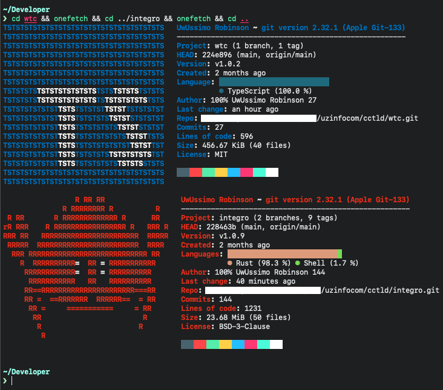

# Bench

After rewriting our project on Rust, we decided to compare benchmarks and stats

## Project

    
## Size

| Name/Platform | Source Code |       Compiled       |
|---------------|:-----------:|:--------------------:|
| WTC/Deno      |    500kb    | 33mb (deno included) |
| Integro/Rust  |    149kb    |         5mb          |

## Networking benchmark (same specs)

| Name/Platform |   req/s   |         success rate         |
|---------------|:---------:|:----------------------------:|
| WTC/Deno      |    20k    | 80% / 20% (errors, throttle) |
| Integro/Rust  | 200k-250k |             100%             |

## Features

|                WTC                 |                         INTEGRO                          |
|:----------------------------------:|:--------------------------------------------------------:|
| Interpreted (need to install deno) |       Natively Compiled (+ cross platform support)       |
|          Single Threaded           |                      Multi Threaded                      |
|   Has Memory Leak at some point    |                   Nope, never ever...                    |
|    Relies on Garbage Collector     | Comes with custom optimisations which shrinks bite sizes |
|    Hard to maintain as it grows    |    Easy to maintain thanks for packaging environment     |
|             Weak Typed             |      Strong Typed (Serialization, Deserialization)       |

